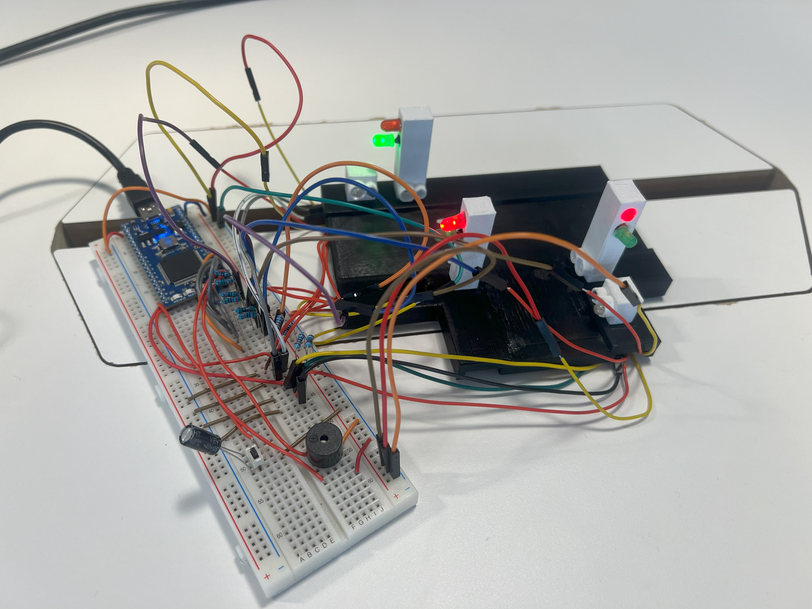

# Traffic-light-problem
Operating a traffic light system with infrared sensors and led traffic lights using interrupts and c++ oop programming principles.
## How it works
The system creates a state change machine which passes a control flag accross objects representing each member in the junction. The control flag signals if a member is currently in control of the traffic lights.
The system uses this flag and a priority queue that assigns based on the first-come-first-served principle, to decide the order of the traffic light operation.
When a member is in control, it triggers its green light after a waiting time, and then triggers it's red light after a safety time, that begins once the light is green.
## Video of Assembled model operation

## Scalability
The System is designed with scalability in mind, it operates by creating pedestrian light and traffic light objects using two class structures for each one, with customisable parameters for each object.
To scale the model. the priority matrix and the control flag parameters need to be edited, as outline in the comments pf the code. 
